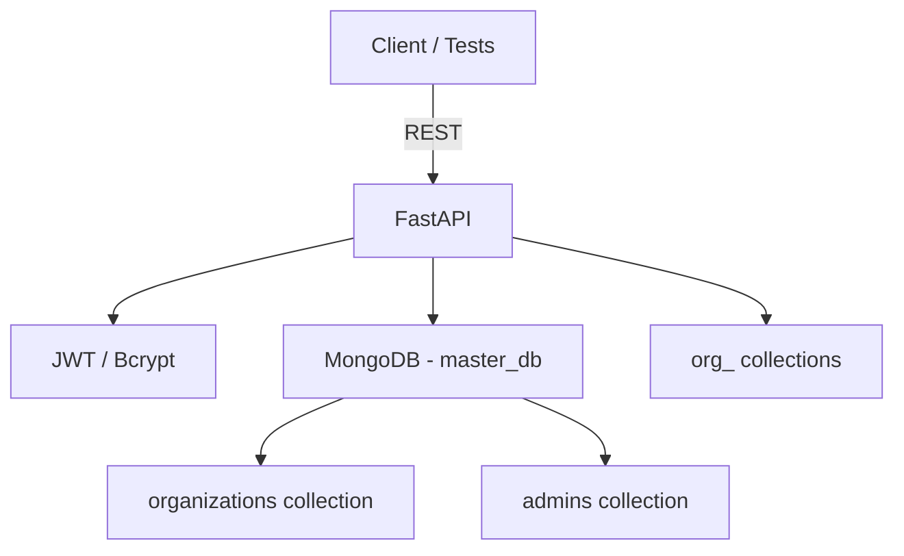

# Organization Management Service

FastAPI + MongoDB backend for multi-tenant organization management. Supports dynamic collection creation per organization, admin auth via JWT, and CRUD for organization metadata.

## Features
- Create organization with dedicated Mongo collection `org_<slug>`, and seeded admin user (hashed password).
- Admin login returns JWT with admin/org identifiers.
- Fetch, rename, update admin email/password, and delete organization (authenticated).
- Master database stores org metadata, connection info placeholder, and admin credentials.
- Healthcheck at `/health`.

## Quickstart
1. Prereqs: Python 3.11+, MongoDB running at `mongodb://localhost:27017`.
2. Install deps:
   ```bash
   python -m venv .venv
   source .venv/Scripts/activate  # on Windows use: .venv\Scripts\activate
   pip install -r requirements.txt
   ```
3. Configure env:
   ```bash
   cp env.example .env  # or set env vars manually
   ```
4. Run API:
   ```bash
   uvicorn app.main:app --reload
   ```
5. Interactive docs at `http://127.0.0.1:8000/docs`.

## Endpoints (summary)
- `POST /org/create` – body: `organization_name`, `email`, `password`.
- `GET /org/get?organization_name=...`
- `PUT /org/update` – body: `organization_name` (current), optional `new_organization_name`, `new_email`, `new_password` (Bearer token required).
- `DELETE /org/delete?organization_name=...` (Bearer token required).
- `POST /admin/login` – body: `email`, `password`.

## Design Notes
- **Master DB**: collections `organizations`, `admins`; org collection names follow `org_<slug>`.
- **Dynamic collections**: created on org creation; rename on org rename keeps data.
- **Auth**: JWT (HS256) with admin/org IDs; bcrypt hashing via `passlib`.
- **IDs**: UUID4 hex strings to avoid ObjectId coupling.
- **Validation**: unique org slug and admin email enforced at app layer.

### Trade-offs & Scalability
- Single Mongo database keeps ops simple; for larger scale, per-org database or sharded collections would isolate load at the cost of connection management.
- Using collection rename keeps data intact but is a metadata operation; for cross-DB moves, copy + swap would be needed.
- JWT stateless auth scales horizontally; rotating secrets requires key versioning if sessions must survive rotations.
- Async motor driver allows high concurrency; ensure connection pool sizing matches workload.

## Architecture (high level)


## Sample cURL
```bash
curl -X POST http://127.0.0.1:8000/org/create \
  -H "Content-Type: application/json" \
  -d '{"organization_name":"Acme","email":"admin@acme.com","password":"Secret123"}'
```

## Deployment
- Suitable for containerization; run `uvicorn app.main:app --host 0.0.0.0 --port 8000`.
- Configure `MONGO_URI`, `MASTER_DB_NAME`, `JWT_SECRET`, `ACCESS_TOKEN_EXPIRE_MINUTES` in environment for your environment.

## TODO / Next Steps
- Add unit/integration tests (e.g., pytest + httpx + mongomock or test DB).
- Add rate limiting and audit logging for admin actions.
- Optional: per-org DB support and migrations for org collections.


